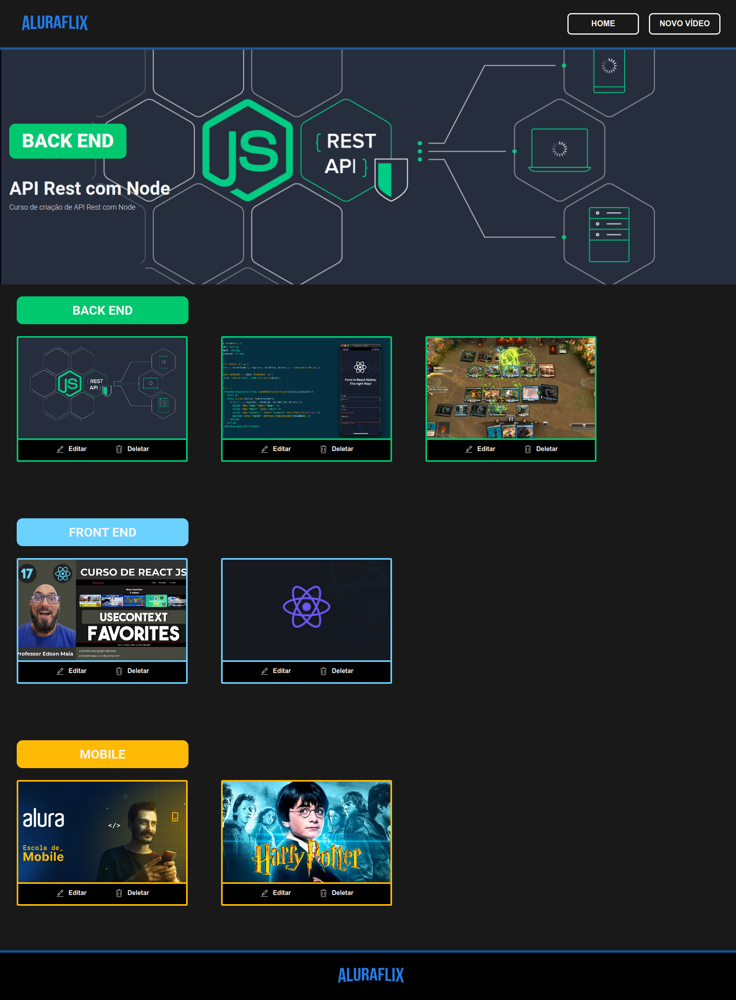
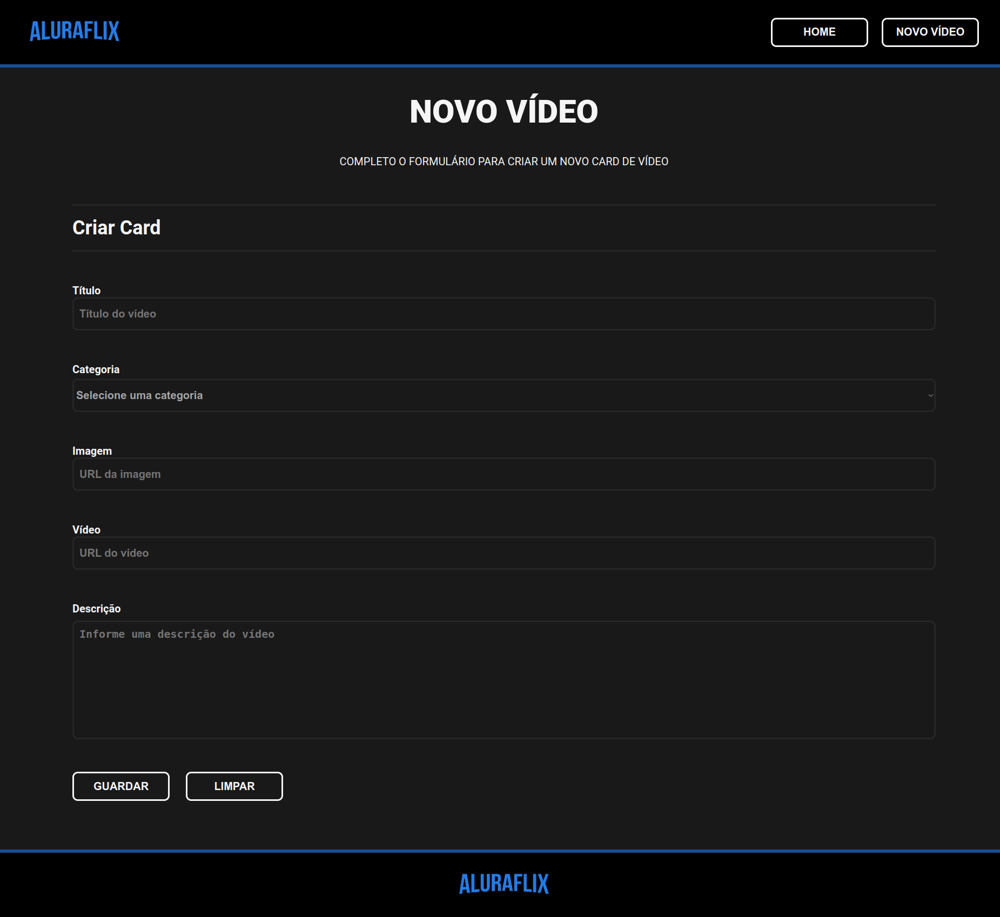
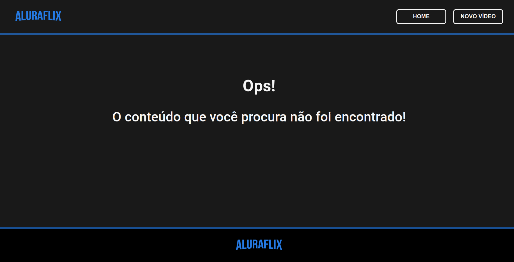

# AluraFlix - Cadastro de Cards

Este projeto é uma aplicação para cadastro de cards de vídeos, desenvolvida com React, utilizando tecnologias como react-router-dom, react-icons, e CSS Modules. O objetivo é praticar a componentização, rotas, responsividade e gerenciamento de estado com Context API e hooks personalizados.

## Descrição

A aplicação permite o cadastro, edição e exclusão de cards de vídeos, onde cada card contém informações como título, URL da imagem, categoria, URL do vídeo do YouTube e descrição. As categorias disponíveis são: Front-End, Back-End e Mobile, com cores específicas para cada uma.

## :dizzy: Tecnologias utilizadas

<div>
  
  
  
  
</div>

## :hammer: Funcionalidades

- Cadastro de Cards: Adicione novos cards preenchendo informações como título, URL da imagem, categoria, URL do vídeo e descrição.
- Edição de Cards: Edite os cards existentes.
- Exclusão de Cards: Remova cards da lista.
- Visualização de Vídeos: Clique na imagem do card para assistir ao vídeo em um modal.
- Responsividade: A aplicação é responsiva e se ajusta a diferentes tamanhos de tela.
- Persistência de Dados: Utiliza MockAPI para persistir os dados.
- Context API e Hooks Personalizados: Gerencia o estado dos cards e as categorias.
- Categorias: Armazena categorias em um arquivo category.json com cores específicas para cada uma.

## :camera_flash: Capturas de Tela

### Página Inicial



### Página de Cadastro


### Página Não Encontrada



## :globe_with_meridians: Acesso ao Deploy do projeto

### Vercel

O projeto está disponível na Vercel. Você pode acessá-lo através do seguinte link: 

[AluraFlix na Vercel.]()

## :bricks: Estrutura do Projeto
- src/
  - components/: Componentes reutilizáveis.
  - pages/: Páginas da aplicação (DefaultPage, Home, NewVideo e NotFound).
  - styles/: Arquivos de estilos CSS Modules.
  - global.css: Arquivo de estilo CSS global.
  - contexts/: Contextos para gerenciamento de estado.
  - hooks/: Hooks personalizados.
  - mocks/: Arquivos de dados, como category.json.
  - routes.jsx: Configuração das rotas e componente principal.

## :warning: Instalação

### :dvd: Passo a Passo

1. Clone o repositório:

   ```bash
   git clone https://github.com/charlesbrcosta/Desafio-T6-One-AluraFlix.git
   cd Desafio-T6-One-AluraFlix

2. Instale as dependências:
    ```bash
    npm install ou npm i

3. Inicie o servidor de desenvolvimento:
    ```bash
    npm run dev


## :world_map: Rotas
- /: Página inicial que exibe os cards cadastrados.
- /novoVideo: Página para adicionar um novo card.

## :newspaper: Páginas e Componentes
- DefaultPage: Layout padrão com o Footer e o conteúdo das páginas.
- NotFound: Página de erro 404 para rotas não encontradas.
- Home: Página principal que exibe os cards.
- NewVideo: Página para cadastro de novos cards.

## :iphone: Responsividade
A aplicação foi projetada para ser responsiva e se adaptar a diferentes tamanhos de tela, garantindo uma boa experiência em dispositivos móveis e desktops.

## :handshake: Contribuição

Se você quiser contribuir com o projeto, siga os passos abaixo:

    Faça um fork deste repositório.
    Crie uma nova branch (git checkout -b feature/nova-feature).
    Faça commit das suas alterações (git commit -am 'Adiciona nova feature').
    Faça push para a branch (git push origin feature/nova-feature).
    Abra um Pull Request.

## :student: Autor

[<br><sub>Charles Bruno</sub>](https://github.com/charlesbrcosta)


## :page_facing_up: Licença

Este projeto está licenciado sob a [Licença MIT](https://www.mit.edu/~amini/LICENSE.md).